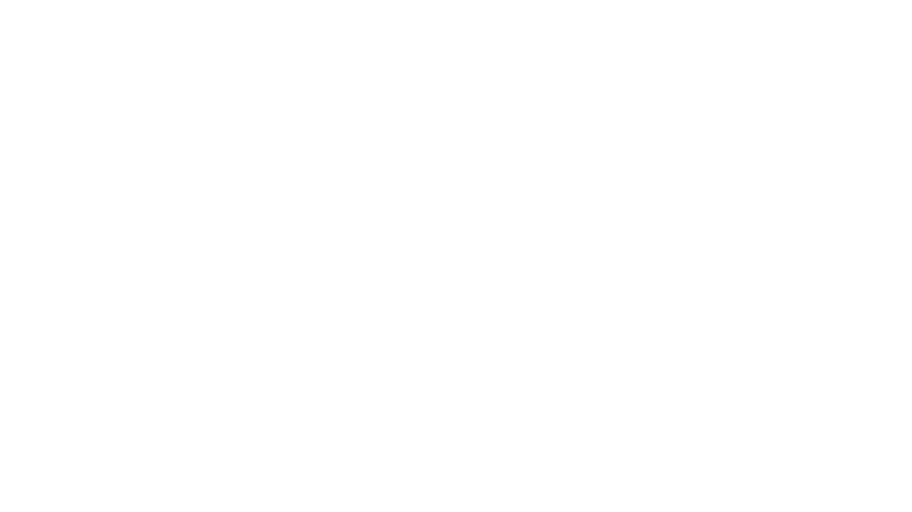

---
# You can also start simply with 'default'
theme: seriph
# random image from a curated Unsplash collection by Anthony
# like them? see https://unsplash.com/collections/94734566/slidev
# background: https://cover.sli.dev
# some information about your slides (markdown enabled)
title: Liquid Haskell
info: |
  ## Slidev Starter Template
  Presentation slides for developers.

  Learn more at [Sli.dev](https://sli.dev)
# apply unocss classes to the current slide
class: text-center
# https://sli.dev/features/drawing
drawings:
  persist: false
# slide transition: https://sli.dev/guide/animations.html#slide-transitions
transition: slide-left
# enable MDC Syntax: https://sli.dev/features/mdc
mdc: true
---

# Liquid Haskell

Mehran Shahidi, Saba Safarnezhad

Supervised by

Cass Alexandru, M.Sc.

<!-- <div @click="$slidev.nav.next" class="mt-12 py-1" hover:bg="white op-10">
  Press Space for next page <carbon:arrow-right />
</div> -->

<div class="abs-br m-6 text-xl">
  <button @click="$slidev.nav.openInEditor" title="Open in Editor" class="slidev-icon-btn">
    <carbon:edit />
  </button>
  <a href="https://github.com/m3hransh/seminar-pl/" target="_blank" class="slidev-icon-btn">
    <carbon:logo-github />
  </a>
</div>

<style>
h1 {
  background-color:rgba(184, 39, 175, 0.71);
  background-image: linear-gradient(45deg, #4EC5D4 10%,rgb(99, 7, 111) 50%);
  background-size: 100%;
  -webkit-background-clip: text;
  -moz-background-clip: text;
  -webkit-text-fill-color: transparent;
  -moz-text-fill-color: transparent;
}
</style>
<!--
The last comment block of each slide will be treated as slide notes. It will be visible and editable in Presenter Mode along with the slide. [Read more in the docs](https://sli.dev/guide/syntax.html#notes)
-->

---
transition: fade-out
---

# What is LiquidHaskell?

Liquid Haskell is a program verifier for haskell that has following features:

<br>

- 📝 **Refinement Types** - Refines haskell types with logical predicates
- 🔣 **SMT-Solver** -  SAT + Theores (Uninterpreted Functions , Arithmetic , Arrays, Algebraic Datatypes, ...)
- 📤 **GHC-Plugin** - You can use LH via LSP or on compilation
- 🤔 **Reflection** - Allows to lift functions in haskell into decidable logic realm
- 🟰 **Proof by Logical Evaluation (PLE)** - Empowers LiquidHaskell as a theorem prover by automating logical evaluations. 

<br>


<!-- Read more about [Why Slidev?](https://sli.dev/guide/why) -->

<!--
You can have `style` tag in markdown to override the style for the current page.
Learn more: https://sli.dev/features/slide-scope-style
-->

<style>
h1 {
  background-color:rgba(184, 39, 175, 0.71);
  background-image: linear-gradient(45deg, #4EC5D4 10%, #146b8c 20%);
  background-size: 100%;
  -webkit-background-clip: text;
  -moz-background-clip: text;
  -webkit-text-fill-color: transparent;
  -moz-text-fill-color: transparent;
}
</style>

<!--
Here is another comment.
-->


<div class="absolute bottom-0  right-0 p-10">
{{ $page }}
</div>
---
layout: two-cols
layoutClass: gap-16
---

# Table of contents

<Toc text-sm minDepth="1" maxDepth="2" />

<div class="absolute bottom-0  right-0 p-10">
{{ $page }}
</div>
---
level: 1
---
# Refinement Types


````md magic-move {lines: true}
//step 1
```haskell 
tail :: [a] -> [a]
tail (_:xs) = xs
```
```haskell
tail :: [a] -> [a]
tail (_:xs) = xs
tail [] = error "tail: empty list"
```
//step 2
```haskell
tail :: [a] -> Maybe [a]
tail (_:xs) =  Just xs
tail [] = Nothing
```
```haskell {5-9}
tail :: [a] -> Maybe [a]
tail (_:xs) =  Just xs
tail [] = Nothing

-- Example list
exampleList = [1, 2, 3, 4, 5]

-- always need to handle the empty case
result = tail exampleList >>= tail >>= tail
```
//step 3
```haskell {*|1}
{-@ tail :: {v:[a] | 0 < len v} -> a @-}
tail :: [a] -> [a]
tail (x : _) = x
```

//step 5

```haskell {5-6} 
{-@ tail :: {v:[a] | 0 < len v} -> a @-}
tail :: [a] -> [a]
tail (x : _) = x

x :: [Int]
x = tail []
```
//step 6
```haskell {7-18|9-11,14}
{-@ tail :: {v:[a] | 0 < len v} -> a @-}
tail :: [a] -> [a]
tail (x : _) = x

x :: [Int]
x = tail []
 .
  >> The inferred type
  >>   VV : {v : [GHC.Types.Int] | v == ?a
  >>                               && len v == 0
  >>                               && len v >= 0}
  >> .
  >> is not a subtype of the required type
  >>   VV : {VV##1324 : [GHC.Types.Int] | len VV##1324 > 0}
  >> .
  >> in the context
  >>   ?a : {?a : [GHC.Types.Int] | len ?a == 0
  >>                                && len ?a >= 0}
```
````

<div class="absolute bottom-0  right-0 p-10">
{{ $page }}
</div>
---
level: 1
---
# SAT
<v-clicks>

- **Definition:** Determines if a Boolean formula can be satisfied by assigning truth values to variables.  

- **Problem:** Find an assignment that makes the formula true.  

- **Example:** (𝐴 ∨ ¬𝐵) ∧ (𝐵 ∨ 𝐶)  
  - Satisfying assignment: $A = \text{true}, B = \text{false}, C = \text{true}$.  
- **SAT Solvers:** Efficient algorithms to solve SAT problems.  
- **Applications:**  
  - Formal verification (software and hardware).  
  - Liquid Haskell (SMT solvers for program verification).  

</v-clicks>
<br>

<div class="absolute bottom-0  right-0 p-10">
{{ $page }}
</div>

---
level: 1
---

# SMT Solver

SMT (Satisfiability Modulo Theories) solvers are tools that can check the satisfiability of logical
formulas in a specific theory. 


Extends SAT solvers by adding various theories:

- **Uninterpreted Functions**: Functions without a fixed interpretation.

- **Arithmetic**: Involves numerical calculations and equations.

- **Arrays**: Data structures that store elements in indexed collections.

- **Algebraic Datatypes**: Data types defined by combining other types.

example:
$$
x + y \leq 10 \quad and \quad x = y - 7
$$


<div class="absolute bottom-0  right-0 p-10">
{{ $page }}
</div>
---
---
# Z3 Architecture

<div class="custom-image-container">

</div>


<!--
Hello
-->
<style>
.custom-image-container {
  display: flex;
  justify-content: center; /* Center horizontally */
  align-items: center;    /* Center vertically */
}
.custom-image-container img {
  max-width: 70%; /* Prevent image overflow */
  height: auto;    /* Maintain aspect ratio */
}</style>

<div class="absolute bottom-0  right-0 p-10">
{{ $page }}
</div>
---
layout: section
---
# Verifying Insertion Sort

<div class="absolute bottom-0  right-0 p-10">
{{ $page }}
</div>
---
level: 2
---

## Add LH as plugin to GHC


<div px-30 py-20>

```json {*|7-13|15}
 // .cabal 
 cabal-version: 1.12

 name:           lh-plugin-demo
 version:        0.1.0.0
 ...
 ...
   build-depends:
       liquid-prelude,
       liquid-vector,
       liquidhaskell,
       base,
       containers,
       vector
   default-language: Haskell2010
   ghc-options:  -fplugin=LiquidHaskell
```
</div>

<div class="absolute bottom-0  right-0 p-10">
{{ $page }}
</div>
---
level: 2
transition: fade-out
---


## Defining insertion sort

<div px-30 py-20>

````md magic-move {lines: true}

```haskell 
insert :: (Ord a) => a -> List a -> List a
insert x Nil = Cons x Nil
insert x (Cons y ys)
  | x <= y = Cons x (Cons y ys)
  | otherwise = Cons y (insert x ys) 

```

```haskell {7-9} 
insert :: (Ord a) => a -> List a -> List a
insert x Nil = Cons x Nil
insert x (Cons y ys)
  | x <= y = Cons x (Cons y ys)
  | otherwise = Cons y (insert x ys) 

insertSort :: (Ord a) => List a -> List a
insertSort Nil = Nil
insertSort (Cons x xs) = insert x (insertSort xs)
```

````


</div>

<div class="absolute bottom-0  right-0 p-10">
{{ $page }}
</div>
---
level: 2
transition: fade-out
---

## A Refinement Type for `insert`

<div px-30 py-20>

````md magic-move {lines: true}

```haskell {*|1} 
{-@ insert :: x : _ -> {xs : _ | isSorted xs} -> {ys : _ | isSorted ys } @-}
insert :: (Ord a) => a -> List a -> List a
insert x Nil = Cons x Nil
insert x (Cons y ys)
  | x <= y = Cons x (Cons y ys)
  | otherwise = Cons y (insert x ys) 

```
````

<div v-click mt-5>
The <code>isSorted</code> predicate
         doesn't exist yet <span v-mark.red="3">at the level of refinement logic </span> 🤔
</div>

</div>

<div class="absolute bottom-0  right-0 p-10">
{{ $page }}
</div>
---
level: 2
transition: fade-out
---

## Lifting `isSorted` into the Refinement Logic


<div px-30 py-20>

````md magic-move {lines: true}

```haskell  
isSorted :: (Ord a) => List a -> Bool
isSorted Nil = True
isSorted (Cons x xs) =
  isSorted xs && case xs of
    Nil -> True
    Cons x1 xs1 -> x <= x1
```
```haskell {*|1} 
{-@ reflect isSorted @-}
isSorted :: (Ord a) => List a -> Bool
isSorted Nil = True
isSorted (Cons x xs) =
  isSorted xs && case xs of
    Nil -> True
    Cons x1 xs1 -> x <= x1
```

```haskell {1-2} 
-- make sure you add this or enable reflection through cabal options
{-@ LIQUID "--reflection" @-} 
{-@ reflect isSorted @-}
isSorted :: (Ord a) => List a -> Bool
isSorted Nil = True
isSorted (Cons x xs) =
  isSorted xs && case xs of
    Nil -> True
    Cons x1 xs1 -> x <= x1
```

```haskell {3} 
-- make sure you add this or enable reflection through cabal options
{-@ LIQUID "--reflection" @-} 
{-@ LIQUID "--ple" @-}  -- proof by logical evaluations
{-@ reflect isSorted @-}
isSorted :: (Ord a) => List a -> Bool
isSorted Nil = True
isSorted (Cons x xs) =
  isSorted xs && case xs of
    Nil -> True
    Cons x1 xs1 -> x <= x1
```

```haskell {1} 
{-@ measure isSorted @-}
isSorted :: (Ord a) => List a -> Bool
isSorted Nil = True
isSorted (Cons x xs) =
  isSorted xs && case xs of
    Nil -> True
    Cons x1 xs1 -> x <= x1
```
````

</div>

<div class="absolute bottom-0  right-0 p-10">
{{ $page }}
</div>
---
level: 2
transition: fade-out
---

## Verifying sortedness in Haskell 


<div px-30 py-20>

````md magic-move {lines: true}

```haskell  
{-@ example1 :: {v: Bool | v} @-}
example1 = isSorted (Cons 2 (Cons 1 Nil))
```
```haskell  {1-4}

{-@ type TRUE  = {v:Bool | v    } @-}
{-@ type FALSE = { v: Bool | not v } @-}

{-@ example1 :: TRUE @-}
example1 = isSorted (Cons 2 (Cons 1 Nil))
```

```haskell  {6-16}
{-@ type TRUE  = {v:Bool | v    } @-}
{-@ type FALSE = { v: Bool | not v } @-}

{-@ example1 :: TRUE @-}
example1 = isSorted (Cons 2 (Cons 1 Nil))
 >> .
 >> The inferred type
 >>   VV : {v : GHC.Types.Bool | (v == Demo.Sorting.isSorted 
 >>             (Demo.Sorting.Cons (GHC.Num.Integer.IS 2) 
 >>             (Demo.Sorting.Cons (GHC.Num.Integer.IS 1) Demo.Sorting.Nil)))
 >> .
 >> is not a subtype of the required type
 >>   VV : {VV##2509 : GHC.Types.Bool | VV##2509}
```

````
</div>

<div class="absolute bottom-0  right-0 p-10">
{{ $page }}
</div>
---
level: 2
transition: fade-out
---

## Verifying sortedness in logic


<div px-30 py-20>

````md magic-move {lines: true}

```haskell  
{-@ example2 :: {v : () |  isSorted (Cons 1 (Cons 3  Nil)) == True} @-}
example2 :: ()
example2 = () -- Error: can't figure it out on its own
```

```haskell {1} 
import Language.Haskell.Liquid.ProofCombinators
{-@ example2 :: {isSorted (Cons 1 (Cons 3  Nil)) == True} @-}
example2 :: ()
example2 = ()
```

```haskell {5-9}  
import Language.Haskell.Liquid.ProofCombinators
{-@ example2 :: {isSorted (Cons 1 (Cons 3  Nil)) == True} @-}
example2 :: ()
example2 =
  (isSorted (Cons 1 (Cons 3 Nil :: List Int)))
    === (isSorted (Cons 3 Nil) && 1 <= 3)
    === (isSorted (Nil :: List Int) && True && 1 <= 3)
    === True
    *** QED
```
```haskell {1}  
{-@ LIQUID "--ple" @-} 
{-@ example2 :: {isSorted (Cons 1 (Cons 3  Nil)) == True} @-}
example2 :: ()
example2 =
  (isSorted (Cons 1 (Cons 3 Nil :: List Int)))
    === (isSorted (Cons 3 Nil) && 1 <= 3)
    === (isSorted (Nil :: List Int) && True && 1 <= 3)
    === True
    *** QED
```
```haskell   
{-@ LIQUID "--ple" @-} 
{-@ example2 :: {isSorted (Cons 1 (Cons 3  Nil)) == True} @-}
example2 :: ()
example2 = () -- LH can now evaluate it on it's own
```

````

</div>

<div class="absolute bottom-0  right-0 p-10">
{{ $page }}
</div>

---
layout: default
level: 2
transition: fade-out
---

## Insertion proof


<div px-30 py-10>

````md magic-move {lines: true}

```haskell  {*|6} 
{-@ insert :: x : _ -> {xs : _ | isSorted xs} -> {ys : _ | isSorted ys } @-}
insert :: (Ord a) => a -> List a -> List a
insert x Nil = Cons x Nil
insert x (Cons y ys)
  | x <= y = Cons x (Cons y ys)
  | otherwise = Cons y (insert x ys)  -- LH can't figure this out
```

```haskell {6}  
{-@ insert :: x : _ -> {xs : _ | isSorted xs} -> {ys : _ | isSorted ys } @-}
insert :: (Ord a) => a -> List a -> List a
insert x Nil = Cons x Nil
insert x (Cons y ys)
  | x <= y = Cons x (Cons y ys)
  | otherwise = Cons y (insert x ys)  `withProof` lem_ins y x ys
```

```haskell {8-12|*}   
{-@ insert :: x : _ -> {xs : _ | isSorted xs} -> {ys : _ | isSorted ys } @-}
insert :: (Ord a) => a -> List a -> List a
insert x Nil = Cons x Nil
insert x (Cons y ys)
  | x <= y = Cons x (Cons y ys)
  | otherwise = Cons y (insert x ys)  `withProof` lem_ins y x ys

{-@ lem_ins :: y : _ -> {x : _ | y < x} -> {ys : _ | isSorted (Cons y ys)} 
    -> {isSorted (Cons y (insert x ys))} @-}
lem_ins :: (Ord a) => a -> a -> List a -> Bool
lem_ins y x Nil = True
lem_ins y x (Cons y1 ys) = if y1 < x then lem_ins y1 x ys else True
```

```haskell{2,3}
{-@ reflect insert @-}
{-@ insert :: x : _ -> {xs : _ | isSorted xs} 
    -> {ys : _ | isSorted ys && Map_union (singelton x) (bag xs) == bag ys  } @-}
insert :: (Ord a) => a -> List a -> List a
insert x Nil = Cons x Nil
insert x (Cons y ys)
  | x <= y = Cons x (Cons y ys)
  | otherwise = Cons y (insert x ys) `withProof` lem_ins y x ys

{-@ lem_ins :: y : _ -> {x : _ | y < x} -> {ys: _ | isSorted (Cons y ys)} 
    -> {isSorted (Cons y (insert x ys))} @-}
lem_ins :: (Ord a) => a -> a -> List a -> Bool
lem_ins y x Nil = True
lem_ins y x (Cons y1 ys) = if y1 < x then lem_ins y1 x ys else True
```

```haskell{2-3,16-19}
{-@ reflect insert @-}
{-@ insert :: x : _ -> {xs : _ | isSorted xs} 
    -> {ys : _ | isSorted ys && Map_union (singelton x) (bag xs) == bag ys  } @-}
insert :: (Ord a) => a -> List a -> List a
insert x Nil = Cons x Nil
insert x (Cons y ys)
  | x <= y = Cons x (Cons y ys)
  | otherwise = Cons y (insert x ys) `withProof` lem_ins y x ys

{-@ lem_ins :: y : _ -> {x : _ | y < x} -> {ys: _ | isSorted (Cons y ys)} 
    -> {isSorted (Cons y (insert x ys))} @-}
lem_ins :: (Ord a) => a -> a -> List a -> Bool
lem_ins y x Nil = True
lem_ins y x (Cons y1 ys) = if y1 < x then lem_ins y1 x ys else True

{-@ insertSort :: xs : _ -> {ys : _ | isSorted ys && bag xs == bag ys} @-}
insertSort :: (Ord a) => List a -> List a
insertSort Nil = Nil
insertSort (Cons x xs) = insert x (insertSort xs)
```

````
<div v-click="[4, 5]"  >But are the elements of the sorted list the same as those of the original list?</div>
</div>

<div class="absolute bottom-0  right-0 p-10">
{{ $page }}
</div>
---
layout: two-cols
---

# Learn More

- [GitHub (code examples and seminar report)](https://github.com/m3hransh/seminar-pl) 
- [LiquidHaskell Documentation](https://ucsd-progsys.github.io/liquidhaskell/) 

<footer class="absolute bottom-0 left-0 right-0 p-10">
<PoweredBySlidev mt-10 />
</footer>
::right::

<div py-20 px-20>


</div>
